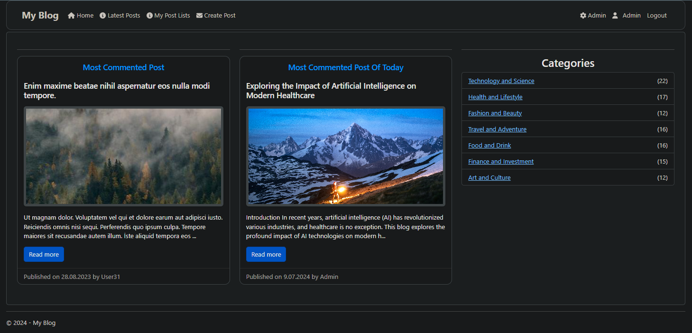
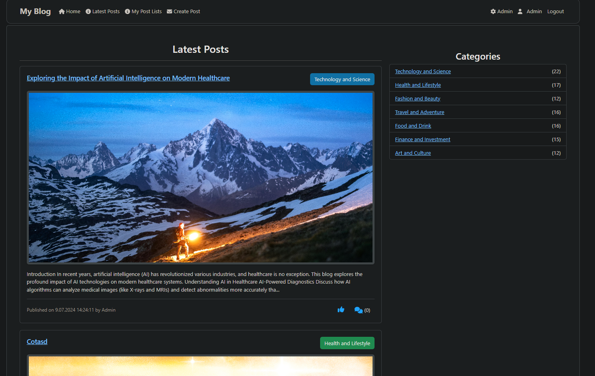
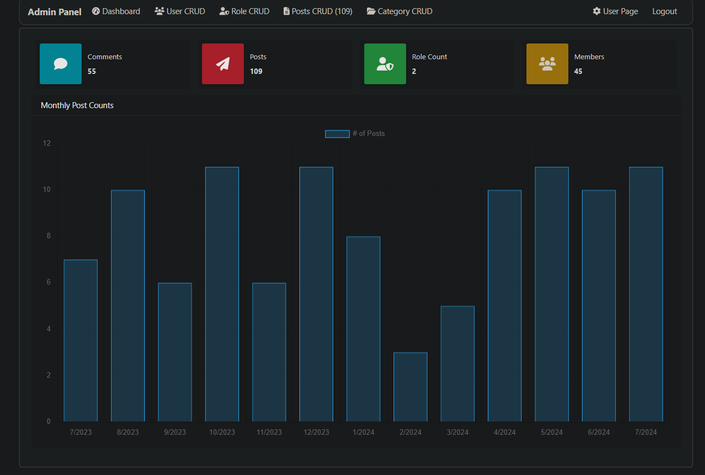
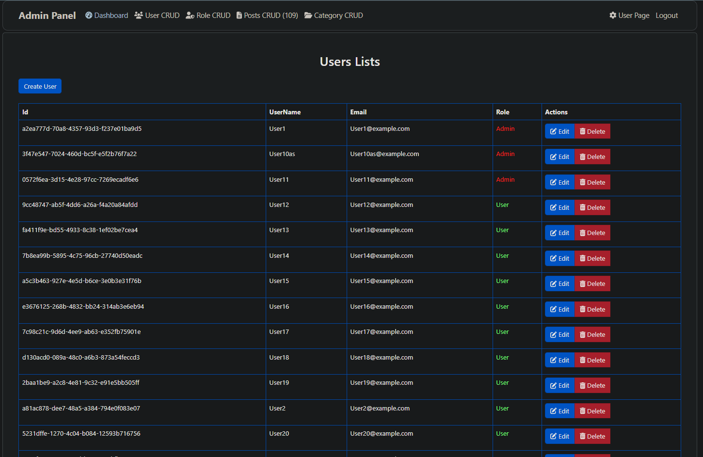
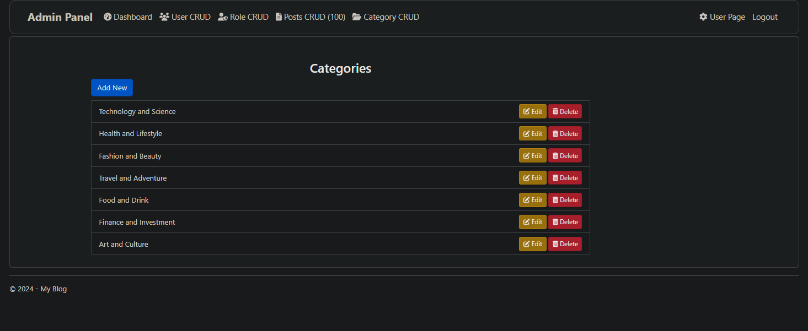
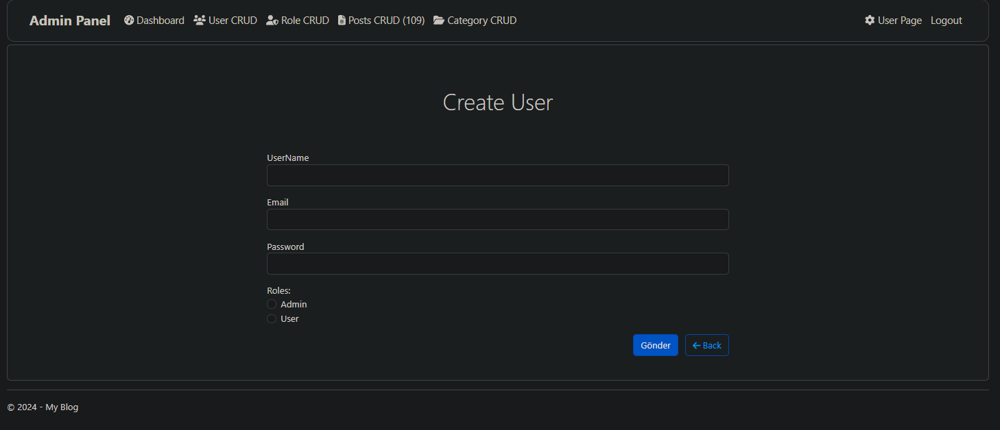

# ASP.NET MVC Blog Project

This project is a simple blog application developed using ASP.NET MVC integrated with Admin LTE 3 for the admin panel.

## Features

- **User Management:** User registration, login, and role management (Admin, Author, Reader).
- **Blog Posts:** Create, edit, and delete posts.
- **Category Management:** Assign categories to posts and list posts based on categories.
- **Comments:** View and manage comments on posts.

## Technologies Used

- ASP.NET MVC 5
- Entity Framework (Code First)
- Bootstrap (Responsive Design)
- Razor Views
- Identity Framework (User Management)
- Admin LTE 3 (Admin Panel UI)

## Installation

1. **Clone the Project:**
   ```bash
   git clone https://github.com/Aaed517/asp-net-mvc-blog.git
   
2. **Extract the Project:**
   Extract the downloaded project files to your desired directory.
   
4. **Database Setup:**
   
   - Open a terminal in the project directory and run the following commands:
     
   ```bash
   dotnet ef migrations add Initial # Creates the initial database migration
   dotnet ef database update  # The project will automatically create the database when it run

6. **Run the Project**
   - Navigate to the /BlogApp directory and run:
     
     ```bash
     dotnet run
     
   - Alternatively, you can run the project from Visual Studio by opening Blog.sln and pressing F5.
     
## Screenshots

Below are example screenshots of different pages in the project:


- **Home Page**: Main screen where users can browse blog posts.
  
- **Latest Posts Page**: Page displaying the most recently published posts.
  
- **Admin Dashboard Page**: Dashboard interface for administrators to manage users, posts, categories, and comments.
  
- **Admin User Crud Page**: This page allows administrators to perform CRUD operations on user accounts, including creating, updating, and deleting users, and managing their roles and permissions.
  
- **Category Crud Page**: Interface for managing categories, including creating, updating, and deleting categories.
  
- **User Create Page**: This page allows administrators to create new user accounts with specified roles and permissions.
  
  
   
   

